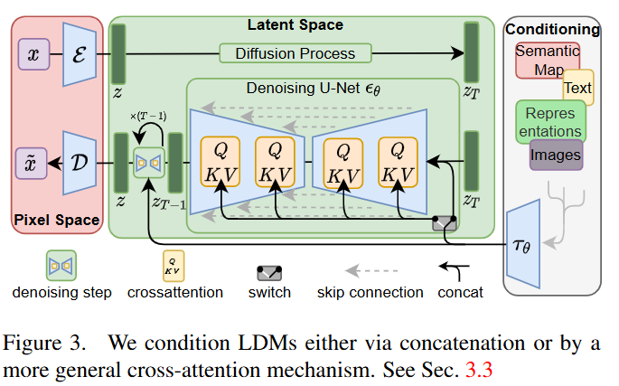
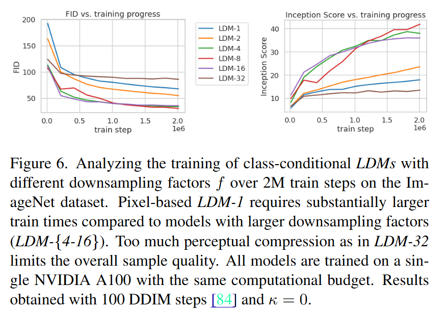
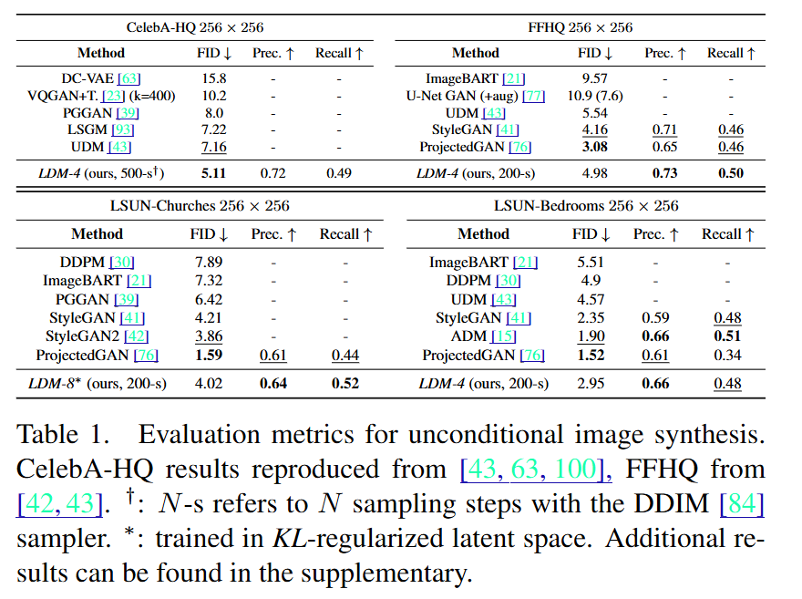
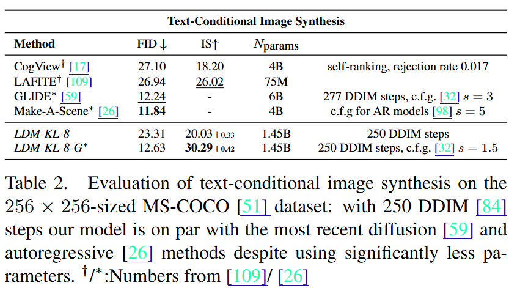
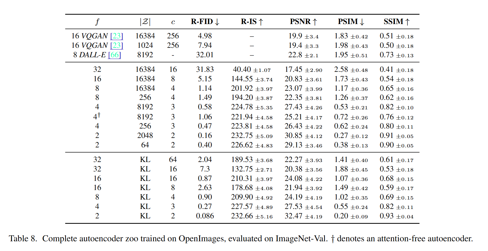

# Latent Diffusion Model (LDM) 

This is an implementation of [High-Resolution Image Synthesis with Latent Diffusion Models](https://arxiv.org/pdf/2112.10752).

## TODO 
- [ ] 

Latent Diffusion Models (LDMs) are a class of generative models that leverage the power of diffusion processes in a latent space to synthesize high-resolution images. The core idea is to perform the diffusion process not directly in the pixel space, but in a more compact latent space, which is learned through an autoencoder. This approach significantly reduces the computational cost and memory requirements, enabling the generation of high-resolution images that would be infeasible with traditional diffusion models.

The paper "High-resolution Image Synthesis with Latent Diffusion Models" introduces this novel framework, highlighting several key contributions:
1. **Latent Space Diffusion**: By conducting the diffusion process in a latent space, the model efficiently captures the essential features of the data, allowing for high-quality image synthesis with reduced computational overhead.
2. **Autoencoder Framework**: The use of an autoencoder to map images to a latent space ensures that the diffusion process operates on a compact and meaningful representation of the data, preserving important structural information.
3. **Scalability**: LDMs are designed to scale to high-resolution image synthesis, making them suitable for applications requiring detailed and large-scale image generation.
4. **Improved Sample Quality**: The integration of diffusion processes in the latent space results in superior sample quality, with images exhibiting high fidelity and diversity.

Overall, Latent Diffusion Models represent a significant advancement in the field of generative modeling, combining the strengths of diffusion processes and latent space representations to achieve state-of-the-art results in high-resolution image synthesis.

## Available Models
The following models are available with different configurations:

**LDM Models:**
Model configurations as taken from Table 14 in the paper

- **LDM-1**: in_channels = 3, model_channels = 192, attention_resolutions = [32, 16, 8], channel_mult = [1, 1, 2, 2, 4, 4]

- **LDM-2**: in_channels = 2, model_channels = 192, attention_resolutions = [32, 16, 8], channel_mult = [1, 2, 2, 4]

- **LDM-4**: in_channels = 3, model_channels = 224, attention_resolutions = [32, 16, 8], channel_mult = [1, 2, 3, 4]

- **LDM-8**: in_channels = 4, model_channels = 256, attention_resolutions = [32, 16, 8], channel_mult = [1, 2, 4]

- **LDM-16**: in_channels = 4, model_channels = 256, attention_resolutions = [16, 8, 4], channel_mult = [1, 2, 4]

## Model Analysis & Results

### Compression/Downsampling Details

### Unconditional Image Generation

### Text-conditional Image Generation

### Autoencoder Zoo

## Citation
> **High-Resolution Image Synthesis with Latent Diffusion Models**  
> *Robin Rombach, Andreas Blattmann, Dominik Lorenz, Patrick Esser, Björn Ommer*  
> arXiv 2022 
> [[Paper]](https://arxiv.org/abs/2112.10752)

